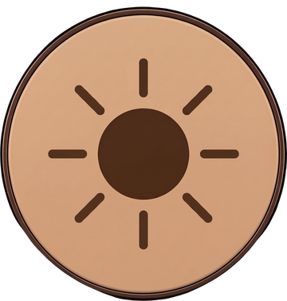

## ☀️ Solaris — Advanced Auto-Brightness & Circadian Monitor Control

<p align="center">
  
</p>

<p align="center">
  <a href="https://github.com/maksim0-debug/Solaris/releases/latest/download/Solaris-Windows.zip">
    
  </a>
  <a href="https://github.com/maksim0-debug/Solaris/releases/latest">
    
  </a>
  <a href="LICENSE">
    
  </a>
</p>

**Solaris** is a professional Windows application built with Flutter that synchronizes your monitor's brightness and color temperature with natural circadian rhythms. By calculating the precise position of the sun (elevation and azimuth) based on your geographic location, Solaris ensures a comfortable, healthy, and fully automated computing experience 24/7.

---

## 🌟 Key Features

### 🌖 Circadian Mode (Auto-Adjustment)

The core of Solaris. The app automatically calculates the sun's position relative to your horizon and adjusts monitor brightness according to a customizable curve.

- **Real-time Sun Tracking**: High-precision calculations for sunrise, sunset, solar noon, and twilight.
- **Smooth Transitions**: Brightness changes are applied gradually to avoid sudden flashes.


### 📈 Interactive Brightness Curves

Don't settle for defaults. Visualize and refine your lighting profile.

- **Bezier Curves**: Fine-tune how brightness responds to solar elevation.
- **Presets**: Swiftly switch between **Bright**, **Balanced**, **Soft**, and **Custom** profiles.
- **Real-time Preview**: See changes instantly on the luminosity graph.
  

### 🖥️ Multi-Monitor Mastery

Full control over your entire workspace.

- **DDC/CI Integration**: Direct hardware communication with monitors via system-level APIs.
- **Individual Control**: Set unique brightness offsets or manual levels for each display.
- **Unified Sync**: Adjust all monitors at once with a single click.


### 🌡️ Dynamic Color Temperature (GPU-Assisted Filter)

Protect your eyes from blue light. Solaris shifts your display to warmer tones as the sun goes down.

- **GPU-Level Control**: Modifies the display's **Gamma Ramp (LUT)** at the graphics card level using Win32 GDI APIs, eliminating hardware communication delays.
- **Universal Compatibility**: Works on **all screens** (including built-in laptop displays, older monitors, or screens without DDC/CI support).
- **Automation & Calibration Care**: Fully synced with the solar cycle. Automatically backs up your original system color curves and restores them when resetting or closing the app.
- **Range**: Smooth transition from 6500K (Daylight) to 3300K (Warm).

### 🎮 Smart Game Mode (Smart Exclusions)

Automates display parameter locks based on active application state.

- **Brightness & Temperature Override:** Enforces fixed brightness and color temperature values (e.g., 80%, 6500 K) upon game detection, suspending automatic ambient adjustments.
- **Minimize Exit Delay:** Configurable buffer delay (in seconds) before restoring default display settings after minimizing a game, preventing flickering during Alt-Tab transitions.
- **Application Filtering:**
  - **Whitelist:** Forcefully activates Game Mode for specified executables (e.g., `cyberpunk2077.exe`).
  - **Blacklist:** Forcefully blocks Game Mode for specific applications (e.g., `chrome.exe`, `telegram.exe`).


### 🎨 Per-App Overrides (Color Accuracy & Custom App Profiles)

Automate monitor settings for specific software applications with pinpoint precision.

- **Automatic Color Accuracy (6500K)**: Ships with **25 factory built-in rules** targeting major color-critical creative software (Photoshop, Premiere Pro, DaVinci Resolve, Lightroom, Blender, Figma, Illustrator, After Effects, Krita, Unreal Engine, Unity, etc.), automatically locking color temperature to neutral **6500K** for accurate color grading.
- **Flexible Per-App Settings**: Set a fixed value or assign a dedicated custom curve independently for brightness and color temperature, or follow the app's global settings.
- **Exit Delay & Immediate Preemption**: Customizable holding timer (0–300s) retains profile settings when minimizing apps to the background, while direct switching between profiled apps applies new settings **instantly (0 ms)**.
- **Native Dual-Tier Focus Detection**: Fast 100ms Win32 polling loop detects focus switches with UWP container support (`ApplicationFrameHost.exe`), Cyrillic/UTF-8 path handling, and System Shell Blacklist filtering.


### ☁️ Weather Influence

The first monitor controller that cares about the sky.

- **Real-time Precision**: Uses **WeatherAPI.com** to fetch highly accurate current weather conditions and cloudiness data for precise brightness adjustments.
- **Cloudiness & Weather Logic**: Naturally dims brightness when it's overcast, rainy, or snowy. Uses **Open-Meteo** as a secondary fallback source.
  - **Precise Weather Correction**: Automatically adjusts daytime brightness based on current weather conditions (e.g., dims the screen during overcast skies, rain, or thunderstorms). Clear skies keep the screen at its standard daylight brightness, while partial cloudiness interpolates the adjustment smoothly. Weather corrections are active only during daylight hours and fade out near sunset.
  - **Overcast Temperature Drop**: Lowers color temperature during bad weather (such as rain or heavy cloud cover) to align monitor tones with the ambient daylight ambiance and reduce blue light strain.
- **Atmospheric UI**: Beautiful background animations for rain, snow, thunder, and clouds within the dashboard.

### ⌨️ Global Hotkeys

Control your environment without leaving your current app.

- **Custom Bindings**: Set shortcuts for Next/Prev Preset, Brightness Up/Down, and Toggling Auto-mode.
- **Stepless Control**: Fine-tune brightness in precise increments (e.g., 5% per press).
  

### 📍 Precise Location

- **Auto-Geolocation**: Uses GPS to determine your coordinates automatically.
- **Mapbox City Search**: Quickly search and select any city worldwide powered by Mapbox geocoding.
- **Interactive Map Selection**: Pinpoint your exact location on an interactive map.
- **Persistence**: Remembers your preferred location across sessions.
  

### 🔄 Automatic Updates

Solaris supports automatic updates directly from within the app:

- **Background Checks**: Checks for new GitHub releases on launch and every 24 hours.
- **Status Bar**: Interactive widget in the footer displays download progress, SHA-256 verification, and readiness for installation.
- **Cryptographic SLSA Security**: Validates downloaded update archives against GitHub's immutable Artifact Attestations API (`actions/attest-build-provenance@v4` / SLSA Provenance v1). Ensures that updates were compiled directly by GitHub Actions CI/CD from open-source code and rejects any manually modified or replaced files.
- **Native Updater (`solaris_updater.exe`)**: Written in C++17 (using `miniz`), creates a backup, protects against vulnerabilities (_Zip Slip_), and performs an **automatic rollback** in case of failure.

> [!NOTE]
> **Custom Builds (`IS_OFFICIAL_RELEASE=false`)**: Automatic updates are disabled by default. Note that updating from a custom build to an official release may reset your saved API keys due to Windows DPAPI encryption mechanics.

---

## 💤 Sleep Integration

Solaris supports sleep data integration to fine-tune monitor brightness and color temperature according to your sleep patterns. You can choose between a local offline integration or sync with Google Fit.


### ⚙️ Smart Circadian Features

When Smart Circadian Regulation is enabled, Solaris applies four physiological models based on your sleep history:

1. **Wind-down Phase**:
   - Gradually reduces brightness and warms screen color temperature (shifting toward amber/red tones) before your target bedtime to stimulate melatonin production.
   - Smoothly restores daytime settings in the morning shortly before your expected wake-up time.
2. **Bio-Morning (Dynamic Anchor)**:
   - Adapts the circadian schedule to your actual wake-up time. If you wake up earlier or later than usual, the system dynamically shifts the brightness and temperature peaks to sync with your body.
3. **Sleep Pressure (Wake Time)**:
   - Evaluates the duration of continuous wakefulness. If you stay awake for too long (over 16 hours), the system starts to gently dim the screen and reduce color temperature to minimize cognitive load.
4. **Sleep Debt Compensation**:
   - Automatically activates if your last sleep was shorter than 6.5 hours. It maintains a more comfortable, muted lighting mode throughout the entire next day to relieve eye strain and fatigue.

---

### 🏠 Local Sleep Integration

If you prefer not to use Google Fit or want a completely offline, internet-free setup, Solaris features a built-in **Local API Web Server**. This allows third-party desktop sleep trackers, smart alarms, or automation scripts running on your PC to feed sleep data directly into the app.

- **How to Enable**: Go to the **Sleep** tab in the app, and turn on the **"Enable local API server"** toggle. You can customize the server port (default is `45321`).
- **Autonomous & Decoupled Subsystem**: The Sleep API operates independently from the main Solaris Control API. You can turn off the Solaris Control API in Settings while keeping the Sleep API active (or vice versa). The server daemon only terminates when both subsystems are disabled. Modifying the server port synchronizes across both screens.
- **Security & Privacy**: By default, the server binds strictly to the local loopback address (`127.0.0.1`), meaning it is inaccessible from external devices. If LAN access is enabled in Settings (`0.0.0.0`), incoming sleep data requests from other devices require an authorized API Bearer token with sleep write permissions (`push_sleep_status`). Unauthenticated LAN requests are strictly rejected with 401 Unauthorized.
- **Data Deduplication**: Local sleep data takes absolute priority. If a sleep session received via Google Fit overlaps with a session from the Local API (within a 1-hour safety buffer), the Google Fit session is automatically discarded to prevent double-logging.
- **Supported Endpoints**:
  1. **Sleep History** (`POST http://127.0.0.1:45321/api/sleep/sessions`):
     Expects a JSON array of sleep session objects:
     ```json
     [
       {
         "id": "unique-session-id-123",
         "startTime": "2026-07-17T00:30:00Z",
         "endTime": "2026-07-17T08:00:00Z",
         "title": "Night Sleep",
         "source": "local_api"
       }
     ]
     ```
  2. **Real-time Status** (`POST http://127.0.0.1:45321/api/sleep/status`):
     Expects a JSON object indicating if the user is currently asleep:
     ```json
     {
       "is_sleeping": true
     }
     ```

---

### 🔐 Google Fit Integration

Solaris supports direct synchronization with **Google Fit** to retrieve your sleep history, enabling high-precision adjustments to monitor color temperature and brightness based on your personal circadian rhythms.

> [!IMPORTANT]
> **Access & Security Policy:** Due to Google's stringent security policies regarding health data (**Restricted Scopes**), public applications are prohibited from accessing sleep history without undergoing an extensive and costly independent security audit.
>
> Consequently, official releases of Solaris do not ship with built-in Google Fit credentials. However, you can easily bypass this restriction using your own personal Google Cloud credentials.

To use Google Fit synchronization, you need to obtain your own Client ID and Client Secret:

1. **Create a Google Cloud Project**: Set up a free project in the [Google Cloud Console](https://console.cloud.google.com/).
2. **Configure OAuth Consent Screen**: Configure the consent screen, add the `fitness.sleep.read` scope, and add your Google account to the test users list.
3. **Create Credentials**: Create an **OAuth Client ID** for a **Desktop Application** to get your **Client ID** and **Client Secret**.

Once you have the credentials, you have two options to integrate them:

- **Option A: Dynamic UI Configuration (Recommended)**
  Simply launch Solaris, navigate to **Settings** -> **API Keys** section at the bottom of the page, paste your **Client ID** and **Client Secret** into the respective fields, and save them. The integration will unlock immediately without restarting.
- **Option B: Build-time Configuration**
  Rename `.env.example` to `.env` in the `solaris/` directory, insert your credentials, and compile the app from source.

---

## 🔑 Dynamic API Keys Configuration

Solaris is designed to be fully functional out-of-the-box, but advanced features (Mapbox maps, WeatherAPI forecasts, Google Fit sleep sync) require specific API credentials. Instead of forcing you to build the application from source code to insert these keys, Solaris features a **Dynamic API Keys Management System** built directly into the UI.


### How to Configure Custom Keys

1. Open Solaris and navigate to the **Settings** tab.
2. Scroll down to the **API Keys** section.
3. Paste your custom credentials into the respective fields:
   - **Custom WeatherAPI Key**: Get a free key from [WeatherAPI.com](https://www.weatherapi.com/) to enable highly accurate weather and cloudiness brightness adjustments.
   - **Custom Mapbox Token**: Create a token on [Mapbox](https://www.mapbox.com/) to unlock the interactive coordinate selection map.
   - **Custom Google Client ID** & **Custom Google Client Secret**: Obtain credentials from the [Google Cloud Console](https://console.cloud.google.com/) to sync your sleep history from Google Fit.
4. Click **Save** next to the field.

### Reactive Runtime Updates

The application relies on Riverpod's reactive state architecture. When you save or clear a key in the settings UI:

- The corresponding services and UI elements update **instantly and on the fly**.
- **No application restart is required**:
  - Pasting a valid Mapbox token immediately unlocks and renders the location map, removing the padlock indicator.
  - Adding a WeatherAPI key enables the "WeatherAPI" option in the weather provider dropdown.
  - Providing Google Fit keys activates the "Connect Google Fit" button on the Sleep integration tab.

### Local Security and Storage

Your custom API keys are secure:

- **Safe Local Storage**: Keys are stored locally on your PC in the application support directory.
- **Hardware-dependent Encryption (Windows DPAPI)**: Keys are encrypted using the Windows Data Protection API (DPAPI). This ensures keys can only be decrypted on the same device by the same Windows user.
- **Key Priority**: Dynamic keys specified in the settings screen always take precedence over static build-time credentials (such as those configured in the `.env` file during compilation).

---

## 🔌 Solaris Control API v1, Outbound Webhooks & WebSocket

Solaris includes a built-in, local HTTP & WebSocket control server that enables third-party applications (Home Assistant, BitFocus Companion, Stream Deck, Raycast, Node-RED, or custom scripts) to query state, adjust monitor parameters, trigger presets, subscribe to real-time events, and receive outbound webhooks.

### 🌟 Key Capabilities

- **Full Automation Gateway**: 28 supported Action System commands (`set_brightness`, `set_temperature`, `set_auto_brightness`, `manage_app_overrides`, `manage_game_mode_whitelist`, etc.).
- **Decoupled Modular Routing**: Solaris Control API and Sleep Integration API can be independently toggled on or off while sharing a single underlying HTTP daemon. Inactive subsystems return RFC 7807 `503 Service Unavailable`, while `/api/v1/health` reports the live health of each module.
- **Friendly Monitor Slugs**: Target displays using human-readable identifiers (`display-1`, `lg-ultragear-a1f9`, `primary`) or system paths (`\\\\.\\DISPLAY1`).
- **Hardened Security Architecture**: 9-Layer Defense & Isolation Pipeline including Host Header DNS Rebinding guard, Payload limiters (64 KB), Subsystem Guard, CSWSH/Drive-by cross-origin guard, per-IP rate limiting, constant-time SHA-256 token authorization, and Granular Zero-Trust ACL Isolation.
- **Outbound Webhooks Engine**: 23 supported event types, SSRF safe validator, True IP-Pinning (TLS SNI Handshake), HMAC-SHA256 delivery signatures (`X-Solaris-Signature-256`), WAL Staging Buffer, and Dead Letter Queue (DLQ).
- **Real-Time WebSocket API**: Bi-directional JSON streaming channel at `/api/v1/ws` with `cmd_id` request correlation, selective module subscriptions, and Windows Power S3/S4 sleep/resume broadcasts.
- **Interactive OpenAPI Docs**: Embedded OpenAPI Docs playground hosted locally at `/api/v1/docs` and raw spec at `/api/v1/openapi.json`.


---

### 📚 API Documentation Catalog

Detailed technical documentation for integrating with Solaris Control API v1 is available in the [`docs/`](docs/) directory:

| Document                                               | Description                                                                                                                                                                 |
| :----------------------------------------------------- | :-------------------------------------------------------------------------------------------------------------------------------------------------------------------------- |
| **[Architecture & Core Guide](docs/API.md)**           | Core design, security pipeline, authentication formats (`X-API-Key`, `Bearer`, `?token`), RFC 7807 error format, and OpenAPI Docs setup.                                      |
| **[REST Endpoints & Action System](docs/REST_API.md)** | State endpoints (`/api/v1/status`, `/api/v1/health`, `/api/v1/presets`, `/api/v1/app-overrides`, `/api/v1/sleep/sessions`), Friendly Slugs, and comprehensive catalog of **all 28 Action commands**. |
| **[Outbound Webhooks Engine](docs/WEBHOOKS.md)**       | Webhook management REST endpoints, **23 Webhook events catalog**, SSRF protection, True IP-Pinning, HMAC-SHA256 signatures, WAL buffer, and DLQ handling.                   |
| **[Real-Time WebSocket API](docs/WEBSOCKET.md)**       | Socket endpoint (`/api/v1/ws`), authentication headers, `cmd_id` correlation, selective module subscriptions, and OS/Hardware error broadcasts.                             |

---

## 🚀 Technical Stack

Solaris leverages cutting-edge technologies for peak performance on Windows:

- **Framework**: [Flutter](https://flutter.dev/) (Windows Desktop)
- **State Management**: [Riverpod](https://riverpod.dev/) (using AsyncNotifiers and StreamProviders)
- **Hardware & OS Interop**:
  - [Dart FFI](https://dart.dev/guides/libraries/c-interop) and [win32](https://pub.dev/packages/win32) for low-level OS calls.
  - Custom MethodChannels for hardware DDC/CI brightness control and GPU Gamma Ramp temperature manipulation.
- **APIs & Services**:
  - **Google Fit API**: Health data synchronization.
  - **WeatherAPI.com**: Advanced weather and cloudiness data.
  - **Open-Meteo**: High-precision weather data fallback.
  - **Mapbox**: Location services.
- **Math engine**: Spherical trigonometry and solar algorithms (`solar_calculator`, `sunrise_sunset_calc`).

---

## 📂 Project Structure

```text
lib/
├── l10n/              # Localization (English, Russian, Ukrainian support)
├── models/            # Data structures (SolarPhase, SettingsState, PresetType)
├── providers/         # Feature-specific logic (Weather, Temperature, Lifecycle)
├── screens/           # UI Screens (Dashboard, Schedule, Settings, Location, Sleep)
├── services/          # Core mechanics (Monitor control, Sun math, Hotkeys)
├── theme/             # Premium Glassmorphism styling and palettes
└── widgets/           # Specialized UI components (SunPathPainter, Dials, Charts)
```

---

### 🛠️ Getting Started

#### 📥 Download (Quick Start)

If you just want to use the application, you can download the latest ready-to-use version from the [Releases page](https://github.com/maksim0-debug/Solaris/releases).

1. Download the `.zip` archive.
2. Extract it to your preferred location.
3. Run `solaris.exe`.

> [!TIP]
> **API Keys & Integrations:** Pre-built releases do not ship with embedded credentials. However, you can configure your own credentials for Google Fit, Mapbox, and WeatherAPI **directly in the app's Settings screen** (no compilation or command-line setup required).

---

#### Building from Source

Solaris can be compiled and executed **entirely without any API keys**. If you do not configure `.env` (or configure it with placeholders), the application will build successfully and run in **Graceful Fallback Mode** (see [Feature Limitations](#-graceful-fallback-mode--feature-limitations) below). However, you can still enter these keys dynamically in the running app's settings at any time.

**Prerequisites:**

- [Flutter SDK](https://docs.flutter.dev/get-started/install) (Stable channel)
- Windows 10/11
- Monitors with **DDC/CI** support (Required for _hardware brightness control_ only; _color temperature adjustments_ work universally). Ensure it is enabled in your monitor's OSD menu.

---

1. **Clone the repository**:

   ```bash
   git clone https://github.com/maksim0-debug/Solaris.git
   ```

2. **Setup Environment Variables**:

   Navigate to the `solaris/` directory, rename `.env.example` to `.env`.

   ```bash
   cd solaris
   cp .env.example .env
   ```

3. **Configure API Keys (Optional)**:

   Open the newly created `.env` file and insert your credentials to unlock advanced features at build time:
   - **WeatherAPI**: To allow Solaris to adjust brightness based on real-time cloudiness and weather conditions with high precision, [register at WeatherAPI.com](https://www.weatherapi.com/signup.aspx) to get a free API key and paste it into `WEATHER_API_KEY`.
   - **Mapbox**: To use interactive maps for location selection, [get a Mapbox Access Token](https://docs.mapbox.com/help/getting-started/access-tokens/) and paste it into `MAPBOX_TOKEN`.
   - **Google Fit**: If you want to sync your sleep history, follow the [Google Fit Integration](#-google-fit-integration) guide above to get your `GOOGLE_CLIENT_ID` and `GOOGLE_CLIENT_SECRET`.

4. **Get dependencies & generate code**:

   ```bash
   flutter pub get
   dart run build_runner build --delete-conflicting-outputs
   ```

5. **Run the app**:

   ```bash
   flutter run -d windows
   ```

#### Building for Release

```bash
flutter build windows
```

---

### ⚠️ Graceful Fallback Mode & Feature Limitations

If you compile or run Solaris without providing API keys, the application automatically handles this by disabling specific features while keeping the core circadian rhythm engine fully functional. **You can unlock any of these features at runtime by supplying your custom keys in Settings -> API Keys**:

| Feature / Integration          | Requirement        | Fallback Behavior when Key is Missing (Unlockable in Settings)                                                                                                                                                                    |
| ------------------------------ | ------------------ | --------------------------------------------------------------------------------------------------------------------------------------------------------------------------------------------------------------------------------- |
| **Interactive Map & Mini-Map** | `MAPBOX_TOKEN`     | Map areas display a padlock icon. Clicking it shows a tooltip informing that the token is missing. You can still set your coordinates manually. Reverse geocoding falls back to a timezone-based city lookup.                     |
| **WeatherAPI Provider**        | `WEATHER_API_KEY`  | "WeatherAPI" option in Settings is disabled and displays a warning under the selector. Solaris automatically falls back to **Open-Meteo API** (free public endpoints), meaning weather-based brightness shifts remain functional. |
| **Google Fit Integration**     | `GOOGLE_CLIENT_ID` | "Connect Google Fit" button on the Sleep screen is disabled, and an informative warning message is shown. Offline sleep tracking can still be fully synced using the [Local Sleep Integration](#-local-sleep-integration).        |

---

## 📄 Legal

- **Privacy Policy**: [Read our Privacy Policy](https://maksim0-debug.github.io/Solaris/docs)
- **License**: This project is licensed under the **MIT License**. See the [LICENSE](LICENSE) file for details.
- **Third-Party Libraries**:
  - [miniz](https://github.com/richgel999/miniz) ([MIT License](https://github.com/richgel999/miniz/blob/master/LICENSE)) — lossless, data compression library used by updater.

---

_Developed with ❤️ for visual health and focused productivity._
